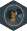

<!-- README.md is generated from README.Rmd. Please edit that file -->

# OSD758 <a href="https://www.pattern.institute/OSD758/"></a>

<!-- badges: start -->

[](https://github.com/patterninstitute/OSD758/actions/workflows/R-CMD-check.yaml)
<!-- badges: end -->

The `OSD758` R data package provides a compact, real-world example
dataset for illustrating RNA-seq analysis workflows using the DESeq2
package in R. It includes sample metadata and both raw gene expression
counts derived from retinal tissues of mice subjected to varying levels
of artificial gravity during spaceflight. The dataset, originally
published in NASA’s Open Science Data Repository
([OSD-758](https://doi.org/10.26030/d6dj-d777)), offers a biologically
meaningful and technically appropriate starting point for teaching,
demonstration, or method development in differential gene expression
analysis.

## Installation

You can install this data package from [GitHub](https://github.com/)
with:

``` r
# install.packages("pak")
pak::pak("patterninstitute/OSD758")
```

## Code of Conduct

Please note that the OSD758 project is released with a [Contributor Code
of Conduct](https://www.pattern.institute/OSD758/CODE_OF_CONDUCT.html).
By contributing to this project, you agree to abide by its terms.
